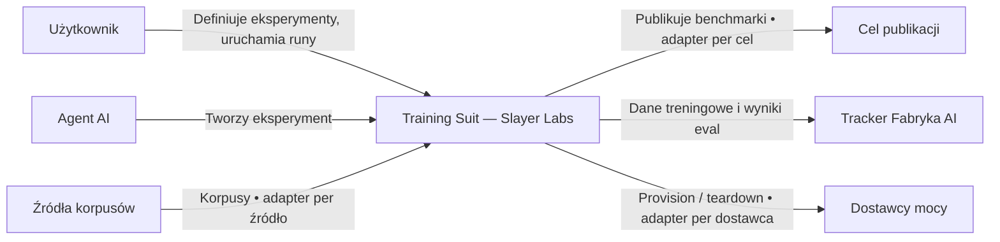
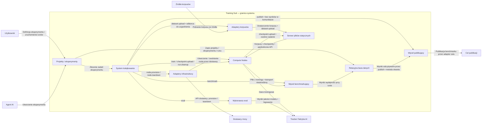
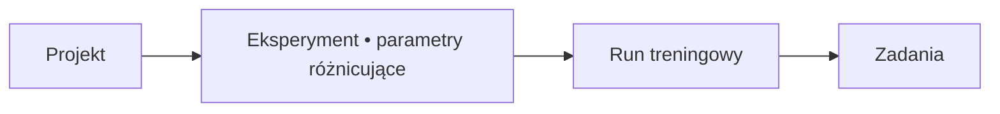

# Training Suit — Slayer Labs

System treningowy dla jednego labu.

## Jak działa system

Użytkownik lub agent AI tworzy eksperyment. Parametry różnicujące określają poszczególne runy. Zadania trafiają przez RabbitMQ do wykonawców; compute nodes realizują trening na podstawie specyfikacji. Korpusy i checkpointy są przechowywane na osobnym serwerze plików. Eval mierzy jakość modelu i loguje ją do Trackera Fabryka AI; benchmark mierzy wydajność, zapisuje wyniki do bazy, a publish odczytuje je i publikuje przez adapter celu.

Dostawcy infrastruktury, źródła korpusów i cele publikacji mają osobne adaptery. Tracker jest osobnym endpointem; jego kontrakt integracji pozostaje do ustalenia.

## C4 — poziom 1: kontekst

### Użytkownik

Definiuje eksperymenty, wskazuje parametry różnicujące i uruchamia runy.

### Agent AI

Tworzy eksperyment zamiast użytkownika. Zakres działania i uprawnień: [DO UZUPEŁNIENIA].

### Cel publikacji

Publiczny portal z benchmarkami wydajności wykonania. Wymienny na inny dashboard, także wewnętrzny labu. Adapter per cel. Integracja: [DO UZUPEŁNIENIA].

https://codesota.com

### Tracker Fabryka AI

Domyślny endpoint trackowania danych z treningu i logowania wyników eval. Protokół i zakres danych: [DO UZUPEŁNIENIA].

https://track.fabryka.ai

### Dostawcy mocy

Dostawcy infrastruktury, każdy z osobnym adapterem wywoływanym przez node.provision i node.teardown.

### Źródła korpusów

Źródła korpusów, w tym przygotowane miksy na wewnętrznym dysku labu. Każde źródło przez własny adapter.

## C4 — poziom 2: kontenery / grupy wykonawcze

Logiczny widok odpowiedzialności; nie jest mapą wdrożeniową. Adaptery są grupami adapterów, a eval ma nieustalonego wykonawcę.

### Projekty i eksperymenty

**Technologia: [DO UZUPEŁNIENIA]**

Użytkownik tworzy eksperyment w interfejsie lub przez agenta AI, wskazuje parametry różnicujące poszczególne przebiegi i uruchamia runy treningowe.

- Wejście: Definicja eksperymentu i parametry różnicujące.
- Wyjście: Zapis w relacyjnej bazie danych; zadania eksperymentu w RabbitMQ.
- [DO UZUPEŁNIENIA]: Rola i zakres uprawnień agenta AI; zakres MVP.

### Relacyjna baza danych

**Silnik i schemat: [DO UZUPEŁNIENIA]**

Relacyjna baza danych połączona z systemem kolejkowania. Zarządza danymi treningowymi oraz wynikami benchmarku zapisanymi przy runie i eksperymencie.

- Wejście: Dane projektu, eksperymentu i runu; wyniki wydajności z węzła benchmarkującego.
- Wyjście: Wyniki odczytywane przez zadanie publish — nie są przekazywane w treści komunikatu.
- [DO UZUPEŁNIENIA]: Schemat danych, kardynalności, atrybuty i sposób odczytu wyników przez publish.

### System kolejkowania

**RabbitMQ**

Kieruje zadania eksperymentu do wykonawców na nodach. Wszystkie zdarzenia runu mają jeden ślad, w tym provision i teardown przez adaptery dostawców.

- Wejście: Zadania eksperymentu.
- Wyjście: Zadania kierowane do właściwych wykonawców.
- [DO UZUPEŁNIENIA]: Typ exchange, routing keys, podział kolejek per zdolność noda i obsługa nieudanych zadań. 

### Compute Nodes

**Ustandaryzowane obrazy / VM / sprzęt**

Maszyny uruchamiające trening według jednego pliku specyfikacji, na poziomie zbliżonym do Ansible: konfiguracja, setup i przebieg całego treningu. Format JSON jest ustaleniem wstępnym.

- Wejście: Plik specyfikacji; korpusy i checkpointy z serwera plików przez ujednolicone API.
- Wyjście: Pliki z treningu do benchmarku; dane treningowe do Trackera Fabryka AI; checkpointy na serwer plików w osobnym zadaniu.
- [DO UZUPEŁNIENIA]: Schemat specyfikacji i potwierdzenie JSON; szczegóły transportu artefaktów.

### Węzeł benchmarkujący

**Technologia: [DO UZUPEŁNIENIA]**

Benchmarkuje pliki z treningu. Mierzy wydajność wykonania, nie jakość modelu. Wyniki zapisuje przy runie w bazie; publikacja jest osobnym zadaniem.

- Wejście: Pliki z treningu z compute node.
- Wyjście: Wyniki wydajności w relacyjnej bazie danych.
- [DO UZUPEŁNIENIA]: Zestaw metryk, procedura benchmarku i format wyjścia.

### Wykonawca eval

**Wykonawca i sprzęt: [DO UZUPEŁNIENIA]**

Wykonuje eval i mierzy jakość modelu. Wykonawca i sprzęt pozostają do ustalenia.

- Wejście: Model i zbiór testowy.
- Wyjście: Wyniki jakości modelu logowane do track.fabryka.ai.
- [DO UZUPEŁNIENIA]: Wykonawca, sprzęt, metryki, procedura i format wyjścia.

### Serwer plików statycznych

**Ujednolicone API: [DO UZUPEŁNIENIA]**

Osobny węzeł przechowujący korpusy treningowe i checkpointy. Przygotowane wcześniej datasety można wgrać przed rozpoczęciem treningu, eliminując ich przetwarzanie na działającym nodzie i oszczędzając czas obliczeniowy.

- Wejście: Przygotowane korpusy ze źródeł oraz checkpointy z compute node.
- Wyjście: Korpusy i checkpointy dostępne dla compute nodes przez ujednolicone API.
- [DO UZUPEŁNIENIA]: Kontrakt API oraz podział wykonania dataset.upload pomiędzy adapter źródła i serwer plików.

### Adaptery infrastruktury

**Jeden adapter na dostawcę**

Wykonują node.provision i node.teardown przez API konkretnego dostawcy. RunPod i managed bare metal. Zmiana dostawcy podmienia adapter, bez zmiany reszty systemu. Zlecenia trafiają przez kolejkę, nie bezpośrednio z zarządzania eksperymentami do API.

- Wejście: node.provision: adres obrazu ze specyfikacji. node.teardown: identyfikator noda.
- Wyjście: Działający compute node albo zwolniona maszyna.
- [DO UZUPEŁNIENIA]: Lista dostawców MVP i wspólny kontrakt adaptera.

### Adaptery korpusów

**Jeden adapter na źródło**

Pobierają korpus ze źródła na serwer plików. Źródła: Hugging Face, podpięte serwisy oraz dysk labu z przygotowanymi miksami.

- Wejście: Korpus z wybranego źródła.
- Wyjście: Korpus przekazany na serwer plików; zasilanie dataset.upload.
- [DO UZUPEŁNIENIA]: Lista źródeł MVP, wspólny kontrakt adaptera i odbiorca dataset.upload.

### Węzeł publikujący

**Adapter per cel publikacji**

Wykonuje publish: odczytuje zapisane wyniki benchmarku z bazy i tworzy wpis w celu publikacji. Domyślnie codesota.com; cel można wymienić na inny dashboard, również wewnętrzny labu.

- Wejście: Wyniki benchmarku odczytane z bazy, nie z komunikatu kolejki.
- Wyjście: Wpis w celu publikacji.
- [DO UZUPEŁNIENIA]: Sposób odczytu bazy do ustalenia przy implementacji; integracja z celem i źródło publikowanych artefaktów.

## C4 — poziom 3: komponenty

[DO UZUPEŁNIENIA] dla każdego kontenera.

## Specyfikacja treningu

Jeden plik opisuje konfigurację, setup oraz przebieg całego treningu, na poziomie zbliżonym do Ansible. Format JSON wymaga potwierdzenia.

Zakres:
- Korpusy treningowe.
- Ustawienia treningu.
- Adres obrazu, dokumentujący środowisko uruchomieniowe.
- Zmiana architektury modelu.

Plik pozwala porównywać zmiany w kontroli wersji, odtwarzać trening i ręcznie edytować konfigurację zamiast skryptów.

Schemat i potwierdzenie formatu: [DO UZUPEŁNIENIA].

## Reguły wykonania

- `checkpoint.upload` to osobne zadanie, nie krok wewnątrz `train`.
- Przerwany upload jest wznawiany bez ponownego treningu; mechanizm wznawiania pozostaje nieopisany.
- `node.provision` i `node.teardown` przechodzą przez kolejkę i adapter dostawcy, nie bezpośrednio z zarządzania eksperymentami do API dostawcy.
- `eval` oraz `benchmark` mają odrębny zakres i odbiorców wyników.
- `publish` czyta wcześniej zapisane wyniki z bazy. Wyników nie ma w komunikacie kolejki. Sposób odczytu zostanie rozstrzygnięty przy implementacji.
- Datasety można przygotować i wgrać przed uruchomieniem treningu, oszczędzając czas maszyny obliczeniowej.

## Zależności zadań

Współbieżność eval i benchmarku oraz kolejność sprzątania pozostają do ustalenia.

1. Przygotowany korpus trafia na serwer plików (`dataset.upload`).
2. Użytkownik / agent AI tworzy eksperyment z parametrami różnicującymi; zarządzanie zapisuje go w bazie.
3. Użytkownik uruchamia runy. Zarządzanie zleca zadania przez RabbitMQ.
4. `node.provision` trafia do adaptera dostawcy, który uruchamia compute node z obrazu wskazanego w specyfikacji.
5. `train`: compute node pobiera korpusy / checkpointy z serwera plików, wykonuje setup i trening według specyfikacji oraz wysyła dane do Trackera Fabryka AI.
6. `checkpoint.upload` zapisuje lokalny checkpoint na serwerze plików jako osobne zadanie.
7. Osobne zadania: `eval` loguje jakość modelu do Trackera; `benchmark` analizuje pliki treningowe i zapisuje wydajność przy runie w bazie. Miejsce wykonania eval jest otwarte.
8. `publish` trafia do węzła publikującego, który odczytuje wyniki z bazy i tworzy wpis w docelowym portalu przez adapter.
9. `run.cleanup` sprząta pliki tymczasowe na compute node; `node.teardown` zwalnia maszynę przez adapter. Warunki i wzajemna kolejność: [DO UZUPEŁNIENIA].

## Model pojęciowy

Kardynalności i atrybuty: [DO UZUPEŁNIENIA].

## Katalog zadań

Numeracja katalogu nie oznacza kolejności wykonania.

| Typ zadania | Wykonawca | Wejście | Wyjście |
|---|---|---|---|
| dataset.upload | Serwer plików / adapter źródła* | Przygotowany korpus | Korpus dostępny przez ujednolicone API |
| node.provision | Adapter dostawcy infrastruktury | Adres obrazu z pliku specyfikacji | Działający compute node |
| train | Compute node | Plik specyfikacji, korpus | Pliki z treningu; dane do track.fabryka.ai |
| checkpoint.upload | Compute node | Checkpoint z dysku lokalnego | Checkpoint na serwerze plików |
| eval | [DO UZUPEŁNIENIA] | Model, zbiór testowy | Wyniki jakości logowane do track.fabryka.ai |
| benchmark | Węzeł benchmarkujący | Pliki z treningu | Wyniki wydajności zapisane przy runie w bazie |
| publish | Węzeł publikujący | Wyniki benchmarku odczytane z bazy | Wpis na codesota.com lub w innym celu |
| node.teardown | Adapter dostawcy infrastruktury | Identyfikator noda | Zwolniona maszyna |
| run.cleanup | Compute node | Ścieżki tymczasowe | Zwolnione miejsce na dysku |

* dataset.upload: podział odpowiedzialności między serwerem plików a adapterem źródła wymaga ustalenia.

## Otwarte kwestie

1. Zakres MVP: które elementy wchodzą do pierwszej wersji.
2. Schemat pliku specyfikacji treningu; potwierdzenie JSON.
3. Kontrakt ujednoliconego API serwera plików statycznych.
4. Metryki i procedura benchmarku oraz eval; format wyjścia.
5. Wykonawca zadania eval i sprzęt, na którym się wykonuje.
6. Sposób integracji z codesota.com; źródło publikowanych artefaktów.
7. Protokół i zakres danych wysyłanych do Trackera Fabryka AI.
8. Schemat relacyjnej bazy danych.
9. Sposób odczytu wyników z bazy przez publish — do rozstrzygnięcia przy implementacji.
10. Konwencja routingu RabbitMQ: typ exchange, klucze, podział kolejek per zdolność noda, obsługa zadań nieudanych.
11. Zakres działania agenta AI przy tworzeniu eksperymentu.
12. Lista dostawców, źródeł korpusów i celów publikacji MVP; wspólny kontrakt adaptera.
13. Poziom 3 C4 (komponenty) dla każdego kontenera.

## Podział odpowiedzialności

- dataset.upload: podział odpowiedzialności między adapterem źródła a serwerem plików wymaga ustalenia.
- run.cleanup wykonuje compute node. Warunki wykonania i kolejność względem node.teardown wymagają ustalenia.
- C2 przedstawia odpowiedzialności elementów. Liczba procesów, replik i maszyn oraz granice wdrożeniowe pozostają do ustalenia.
